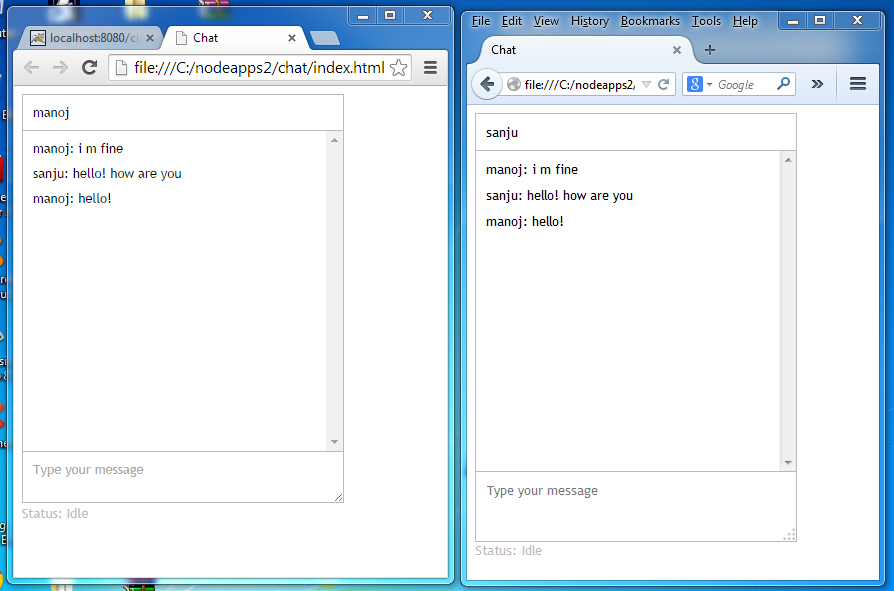
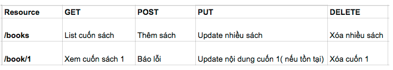

# Đề tài mini hackathon lớp web fullstack 43

### Đề tài 1: Xây dựng website bán hàng sử dụng Nodejs + Express + Mongoose

- Các chức năng:
    + Xác thực sử dụng passport hoặc JWT
    + Shopping cart sử dụng localStorage, Session
    + Tìm kiếm và phân trang
    + Hiển thị thông tin sản phẩm, đánh giá review sản phẩm
    + Deploy lên heroku
    
- Thời gian hoàn thành : 2 tuần
- Điểm hoàn thành : 3/5 chức năng

### Đề tài 2: Xây dựng ứng dụng chat realtime đơn giản sử dụng Nodejs + SocketIO

- Các chức năng:
    + Tạo giao diện gồm khung hiển thị message + box chat + button gửi
    + Khi chưa login có thể chat và hiển thị nội dung chat (realtime)  
    + Đăng ký đăng nhập, tạo nickname (Là điểm cộng)
    + Biết sử dụng thư viện SocketIO
    + Deploy lên heroku

- Thời gian hoàn thành : 2 tuần
- Điểm hoàn thành : 3/5 chức năng

### Đề tài 3: Xây dựng Restfull API (web service) đơn giản sử dụng Node JS + Express + Mongodb (MYSQL)

- Các chức năng:
    + Xác thực sử dụng JWT (Là điểm cộng)
    + Sử dụng đủ 4 HTTP method POST, GET,PUT, DELETE để CRUD (Lấy sách, thêm sách, sửa sách, xóa sách)
    + CRUD với điều kiện đã xác thực (Là điểm cộng)  
    + Biết sử dụng POSTMAN để kiểm tra kết quả API
    + Deploy lên heroku

- Thời gian hoàn thành : 2 tuần
- Điểm hoàn thành : 3/5 chức năng